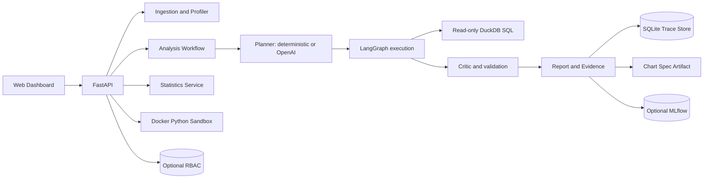

# InsightForge

**InsightForge turns CSV and Parquet datasets into reproducible, evidence-backed analyses with an auditable execution trace.**

Current MVP implements prioritized workflow from planning blueprint:

```text
Dataset upload -> Profiling -> Analysis plan -> Read-only SQL -> Validation -> Report -> Trace
```

## Features

- CSV and Parquet ingestion through DuckDB, with a restricted SQLite CSV fallback for local development.
- File-size, extension, fingerprint, schema, duplicate, missing, PII-name, and basic distribution checks.
- Deterministic planner for aggregation, segmentation, missing-value, ranking, and monthly root-cause questions.
- Optional OpenAI structured planner with deterministic fallback and prompt-injection boundary.
- LangGraph planner, SQL, critic, and report nodes with persisted execution trace.
- Read-only SQL policy blocking mutation, multi-statement queries, external file functions, and dangerous DuckDB commands.
- Welch, Mann-Whitney, Pearson, Spearman, chi-square, effect size, and confidence interval statistics.
- Docker Python sandbox with AST policy, read-only dataset mount, no network, and resource limits.
- Optional MLflow tracking and SQLite-backed RBAC with viewer, analyst, and admin roles.
- Approval, autonomous, benchmark, and evidence-linked reporting modes.
- FastAPI endpoints plus dependency-free dashboard with optional bearer-token login.

## Quick Start

### Docker

```bash
docker compose up --build
```

Open `http://localhost:8000`. API documentation: `http://localhost:8000/docs`.

### Local

Python 3.11+ required. Python 3.12 matches production image.

```bash
uv sync --extra dev
uv run uvicorn apps.api.main:app --reload
```

Run checks:

```bash
uv run pytest
uv run ruff check apps insightforge tests
uv run mypy insightforge apps
```

On startup InsightForge creates `.runtime/` for trace DB, datasets, artifacts, MLflow, benchmark reports, and temporary files. When DuckDB is unavailable, local CSV development uses a restricted SQLite fallback. Parquet and production execution still require DuckDB.

## API Flow

Upload dataset:

```bash
curl -F "file=@benchmark/datasets/retail_small.csv" http://localhost:8000/api/v1/datasets
```

Create approval analysis:

```bash
curl -X POST http://localhost:8000/api/v1/analyses \
  -H "Content-Type: application/json" \
  -d '{"dataset_id":"ds_ID","question":"Berapa total revenue?","mode":"approval"}'
```

Approve plan:

```bash
curl -X POST http://localhost:8000/api/v1/analyses/an_ID/approve
```

Read trace:

```bash
curl http://localhost:8000/api/v1/analyses/an_ID/trace
```

Run smoke benchmark:

```bash
curl -X POST http://localhost:8000/api/v1/benchmarks/run
```

## Architecture



## Security Model

- Uploaded filenames are normalized; supported extensions are `.csv` and `.parquet`.
- Uploads are streamed with configured size limit.
- Generated SQL accepts one `SELECT` or `WITH` statement only.
- SQL mutation, extension loading, attachment, external file functions, comments, and multi-statements are blocked.
- Dataset content is treated as data, never instruction.
- LLM planning receives schema and profile summary, not raw dataset cells by default.
- Python execution is restricted by AST policy and runs only through Docker with a read-only dataset mount, no network, and resource limits.
- Optional RBAC protects analysis, statistics, Python, and admin endpoints.

See `docs/security.md`.

## Current Limits

- Deterministic planner supports a bounded set of intents; OpenAI planning is optional and requires `OPENAI_API_KEY`.
- Python sandbox requires Docker CLI and a running Docker daemon on the API host. Compose does not mount the Docker socket by default.
- MLflow defaults to local SQLite tracking and local artifacts; a shared tracking server is not bundled.
- Benchmark contains smoke records, not the portfolio target of 100 questions; generated report goes to `.runtime/benchmark/reports/`.
- Trace metadata uses SQLite; PostgreSQL, OpenTelemetry, multi-tenant isolation, and a separate sandbox runner remain future hardening.
- Chart output is a JSON chart specification, not a rendered image.

## Roadmap

1. Add a separate sandbox runner service without exposing the Docker socket to the API.
2. Expand benchmark coverage and add adversarial regression cases.
3. Add shared MLflow deployment and OpenTelemetry exporters.
4. Add PostgreSQL and multi-tenant storage after the SQLite workflow is stable.
5. Add richer dashboard rendering for statistics, charts, and trace diffs.

Detailed blueprint remains in `InsightForge_Auditable_Data_Scientist_Agent_Planning.md`.

