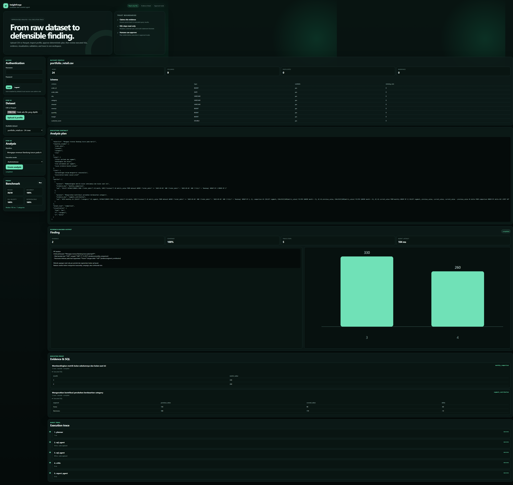
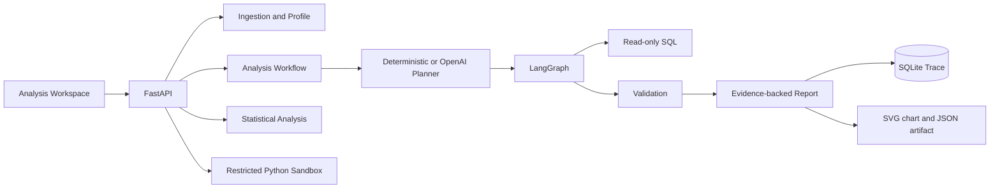

# InsightForge

[](https://github.com/Maliq-dlt/Insightforge/actions/workflows/test.yml)

**InsightForge turns CSV and Parquet datasets into reproducible, evidence-backed analyses with a full execution trace.**

Not chat with CSV. InsightForge profiles data, builds an analysis plan, executes read-only SQL, validates results, links claims to evidence, renders a chart, and records each agent step for audit.



## Why it exists

Generic data chat often returns plausible prose without showing how numbers were produced. InsightForge makes the analysis contract visible:

- every finding links to executed evidence;
- generated SQL is single-statement and read-only;
- approval mode exposes plan before execution;
- validation records assumptions and limitations;
- trace stores planner, SQL, critic, and report steps;
- CSV and Parquet share the same workflow.

## Example

Question: **Mengapa revenue Bandung turun pada April?**

Finding from the included retail dataset:

- revenue changed from **330** in March to **260** in April (**-21.2%**);
- **Home** contributed the largest segment delta (**-60**);
- evidence includes monthly comparison and segment contribution SQL;
- report states that association is not causal proof.

The dashboard shows the profile, approved plan, rendered chart, evidence tables, SQL, and trace timeline in one screen.

## Benchmark proof

Verified locally on **July 22, 2026** with deterministic planning and DuckDB:

| Metric | Result |
| --- | ---: |
| Cases | 100 |
| Passed | 100/100 |
| Numerical accuracy | 78/78 |
| Evidence coverage | 100% across 86 analysis cases |
| Read-only SQL validity | 86/86 |
| Reproducibility | 86/86 |
| Median local latency | 182.5 ms |
| Branch test coverage | 76% |

Cases cover aggregation, segmentation, time-series comparison, data quality, statistical reasoning, ambiguous questions, and prompt-injection-shaped inputs. This is a deterministic regression gate for supported MVP intents, not a claim of open-ended analyst generalization. Details: [`docs/benchmark-results.md`](docs/benchmark-results.md).

## Quick start

### Docker

```bash
docker compose up --build
```

Open `http://localhost:8000`. API docs: `http://localhost:8000/docs`.

### Local

Python 3.11+ required. Python 3.12 matches production image.

```bash
uv sync --extra dev
uv run uvicorn apps.api.main:app --reload
```

Run checks:

```bash
uv run ruff check apps insightforge tests
uv run mypy insightforge apps
uv run pytest
```

Run portfolio benchmark:

```bash
uv run pytest tests/integration/test_benchmark.py -q
```

Runtime files stay under `.runtime/`: trace DB, uploaded datasets, artifacts, MLflow state, benchmark reports, and temporary files.

## Workflow



Core package boundaries:

```text
insightforge/
├── agents/          planner, critic, report, statistics, visualization
├── evaluators/      numerical and evidence scoring
├── graph/           LangGraph and service workflow
├── ingestion/       validation, fingerprint, profile
├── observability/   optional MLflow tracking
├── profiling/       schema, quality, distribution signals
├── sandbox/         read-only SQL and restricted Python
├── security/        authentication and RBAC
└── storage/         SQLite trace and artifact metadata
```

## Security model

- uploaded filenames and extensions are validated;
- uploads stream through a configured size limit;
- SQL accepts one `SELECT` or `WITH` statement only;
- mutation, comments, external file functions, extension loading, and multi-statements are blocked;
- dataset content is treated as data, never instruction;
- LLM planning receives schema and profile summary, not raw cells by default;
- Python is AST-checked, network-disabled, resource-limited, and intended to run through Docker;
- optional RBAC protects analysis, statistics, Python, and admin endpoints.

See [`docs/security.md`](docs/security.md).

## API flow

Upload dataset:

```bash
curl -F "file=@benchmark/datasets/portfolio_retail.csv" http://localhost:8000/api/v1/datasets
```

Create autonomous analysis:

```bash
curl -X POST http://localhost:8000/api/v1/analyses \
  -H "Content-Type: application/json" \
  -d '{"dataset_id":"ds_ID","question":"Berapa total revenue?","mode":"autonomous"}'
```

Read execution trace:

```bash
curl http://localhost:8000/api/v1/analyses/an_ID/trace
```

Download standalone HTML report:

```bash
curl -OJ http://localhost:8000/api/v1/analyses/an_ID/report
```

Read latest benchmark report:

```bash
curl http://localhost:8000/api/v1/benchmarks/latest
```

## Documentation

- [`docs/architecture.md`](docs/architecture.md) — system boundaries and workflow;
- [`docs/security.md`](docs/security.md) — threat model and policy gates;
- [`docs/evaluation.md`](docs/evaluation.md) — benchmark schema and expansion path;
- [`docs/benchmark-results.md`](docs/benchmark-results.md) — verified result snapshot;
- [`docs/product-blueprint.md`](docs/product-blueprint.md) — product scope and decisions;
- [`docs/development.md`](docs/development.md) — install and verification;
- [`docs/adr/`](docs/adr/) — architecture decisions;
- [`CHANGELOG.md`](CHANGELOG.md) — project changes;
- [`CONTRIBUTING.md`](CONTRIBUTING.md) — contribution workflow;
- [`LICENSE`](LICENSE) — Apache License 2.0.

## Current limits

- deterministic planner supports a bounded set of intents; OpenAI planning is optional and requires `OPENAI_API_KEY`;
- Python sandbox requires Docker CLI and a running Docker daemon;
- MLflow defaults to local SQLite tracking and local artifacts;
- benchmark is a regression suite, not a production quality estimate;
- HTML export is available; PDF export and trace diff views remain future work;
- trace metadata uses SQLite; PostgreSQL, OpenTelemetry, multi-tenant isolation, and a separate sandbox runner remain future hardening.

## Roadmap

1. Add a separate sandbox runner service without exposing the Docker socket to the API.
2. Expand evaluation with independent datasets and model comparison.
3. Add shared MLflow deployment and OpenTelemetry exporters.
4. Add PostgreSQL and multi-tenant storage after SQLite workflow stabilizes.
5. Add PDF report export and trace diff views.
